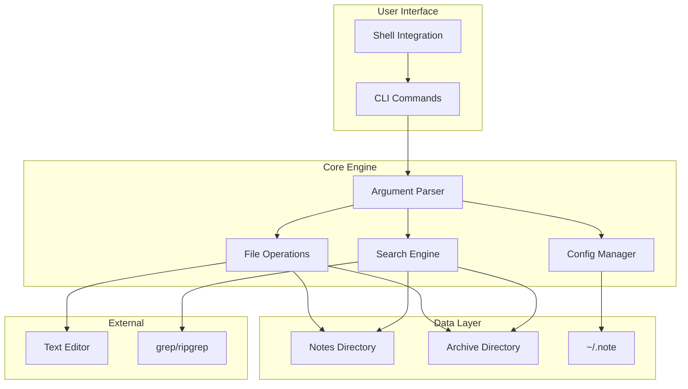
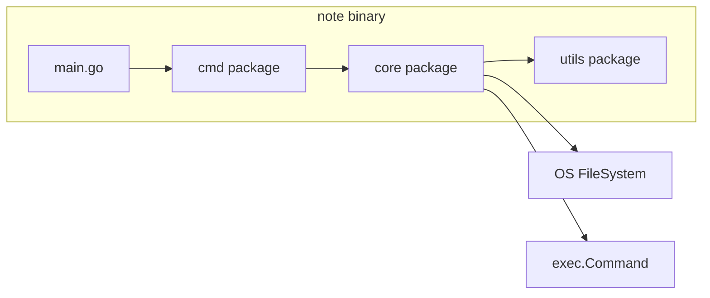
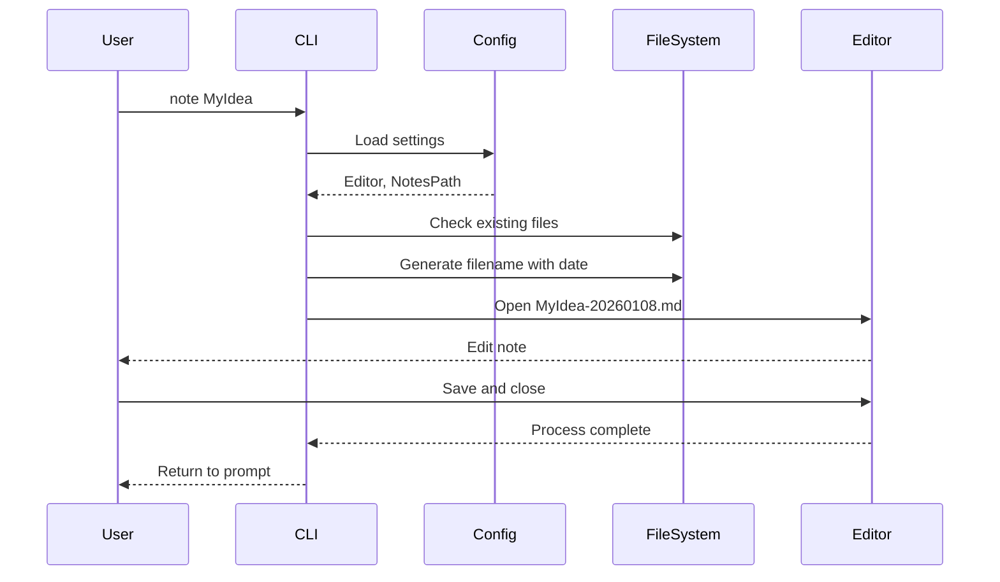
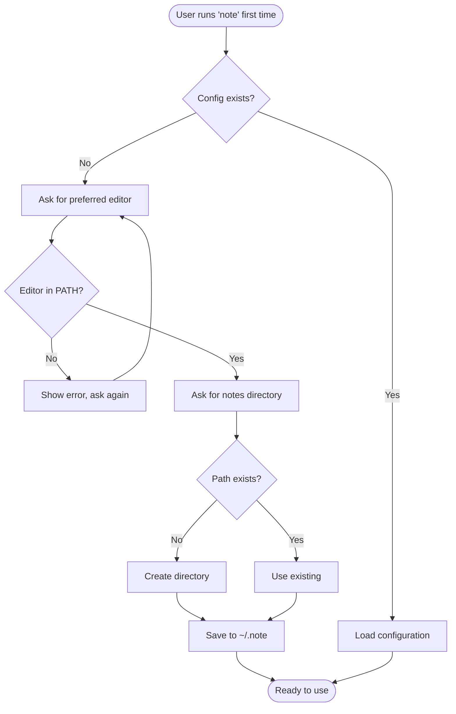
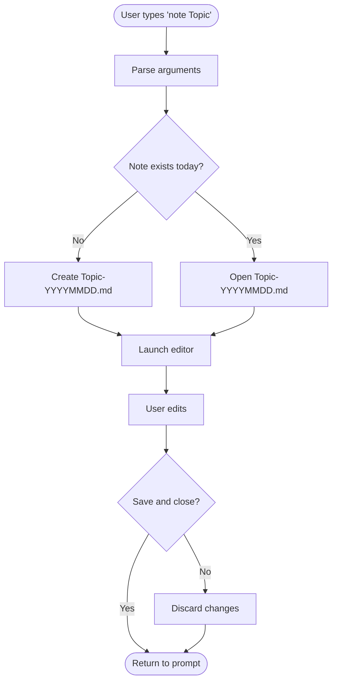
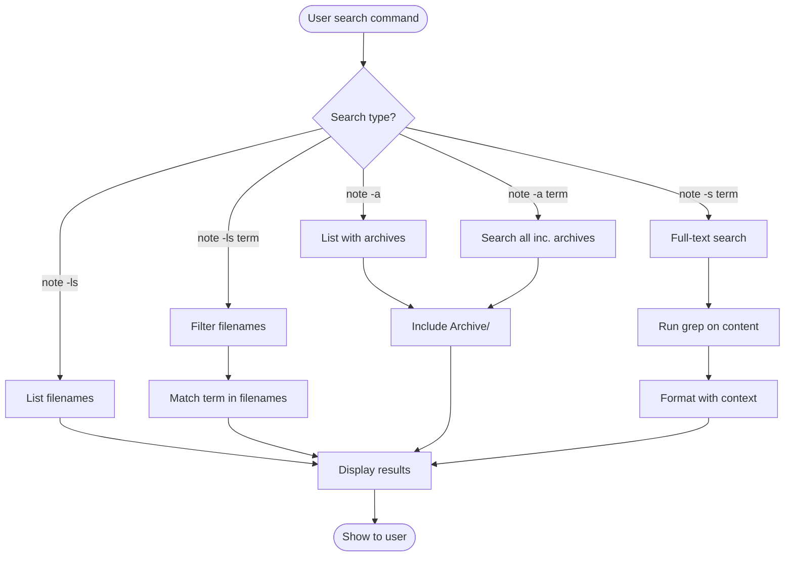

# Product Requirements Document: `note` CLI Tool

## Executive Summary

`note` is a minimalist, opinionated command-line note-taking tool that embraces Unix philosophy: do one thing well and compose with other tools. It provides a frictionless workflow for creating, accessing, and organizing markdown notes with automatic date stamping, designed for users who live in the terminal and prefer text editors over web interfaces.

**Core Philosophy**: Maximum simplicity, zero friction, complete interoperability.

## Problem Statement

### Current Pain Points
- **Note Fragmentation**: Notes scattered across multiple apps, formats, and locations
- **Tool Bloat**: Existing solutions (Obsidian, Joplin, nb.sh) include features many CLI users don't need
- **Workflow Disruption**: Switching contexts from terminal to GUI apps breaks flow
- **Over-Engineering**: Complex systems for simple text files
- **Lock-in Risk**: Proprietary formats or database storage preventing tool switching

### Target Users
- **Primary**: Developers, sysadmins, and technical writers who live in the terminal
- **Secondary**: Researchers, students, and knowledge workers comfortable with CLI
- **Characteristics**:
  - Prefer keyboard over mouse
  - Use terminal for 50%+ of daily tasks
  - Value speed and efficiency over visual features
  - Already use text editors (vim, emacs, nano, vscode)

## Solution Overview

`note` provides an opinionated, minimalist workflow:
1. **Single command** to create/open notes
2. **Automatic dating** for version tracking
3. **Simple search** for finding notes
4. **Archive system** instead of deletion
5. **Plain markdown** for universal compatibility

## User Stories

### Epic: Core Note Management

#### Story 1: First-Time Setup
**As a** new user  
**I want** a simple 2-question setup process  
**So that** I can start taking notes immediately

**Acceptance Criteria:**
- [ ] Setup asks only for editor and notes directory
- [ ] Validates editor exists in PATH
- [ ] Creates notes directory if missing
- [ ] Saves config to `~/.note` file
- [ ] Works with existing note directories

#### Story 2: Creating Notes
**As a** terminal user  
**I want** to create notes with automatic dating  
**So that** I have chronological organization without thinking

**Acceptance Criteria:**
- [ ] `note MyTopic` creates `MyTopic-YYYYMMDD.md`
- [ ] Opens in configured editor immediately
- [ ] Handles spaces in names appropriately
- [ ] Prevents naming conflicts on same day

#### Story 3: Accessing Existing Notes
**As a** returning user  
**I want** quick access to previous notes  
**So that** I can continue or reference past work

**Acceptance Criteria:**
- [ ] Tab completion for note names
- [ ] Opens exact filename if provided
- [ ] Fuzzy matching for partial names
- [ ] Most recent version opened by default

#### Story 4: Searching Notes
**As a** user with many notes  
**I want** to search by title and content  
**So that** I can find information quickly

**Acceptance Criteria:**
- [ ] `note -ls` lists all notes
- [ ] `note -ls term` filters by filename
- [ ] `note -s term` searches full text
- [ ] Case-insensitive search
- [ ] Shows matches with context

#### Story 5: Archiving Notes
**As a** organized user  
**I want** to archive old notes without deletion  
**So that** I maintain history while reducing clutter

**Acceptance Criteria:**
- [ ] `note -rm` moves to Archive folder
- [ ] Accepts wildcards for bulk operations
- [ ] Confirms before archiving multiple
- [ ] `note -a` searches including archives

## Technical Architecture

### System Overview



### Component Architecture



### Data Flow



## User Flows

### New User Onboarding



### Note Creation Flow



### Search Flow



## API Specifications

### Command-Line Interface

```bash
# Core Commands
note [name]              # Create/open note with automatic dating
note [name-date.md]      # Open specific dated note
note --config            # Run setup/reconfigure
note --help, -h          # Show help

# List/Search Commands  
note -ls, -l             # List all current notes
note -ls, -l [pattern]       # List notes matching pattern
note -s [term]           # Full-text search in notes
note -a                  # List all notes (including archived)
note -a [pattern]        # Search all notes including archived

# Archive Commands
note -rm [pattern]       # Archive matching notes
note --restore [name]    # Restore from archive (future)

# Environment Variables
EDITOR                   # Fallback if not configured
NOTE_DIR                 # Override notes directory
```

### Configuration File Format

```bash
# ~/.note
editor=nvim
notesdir=~/Documents/Notes
dateformat=YYYYMMDD  # Future: customizable
```

## Data Models

### File Structure

```
$NOTE_DIR/
├── Archive/
│   ├── OldProject-20240115.md
│   └── Deprecated-20240203.md
├── DailyStandup-20260108.md
├── ProjectIdeas-20260107.md
├── BugNotes-20260105.md
└── README.md  # User's own file, untouched
```

### Note Filename Schema

```
Pattern: {UserProvidedName}-{DateStamp}.{Extension}

Examples:
- MeetingNotes-20260108.md
- bug-report-20260108.md
- Project_Alpha_Design-20260108.md

Rules:
- UserProvidedName: Any valid filename chars except dash at end
- DateStamp: YYYYMMDD format, always 8 digits
- Extension: Always .md (future: configurable)
```

## Implementation Phases

### Phase 1: Core Functionality (MVP)
**Goal**: Replace basic note-taking workflow

- [x] Initial setup flow
- [x] Create notes with auto-dating
- [x] Open existing notes
- [x] Basic list functionality (-ls)
- [x] Configuration management
- [ ] Comprehensive help text

**Validation**:
```bash
go test ./...
note TestNote && echo "Success"
note -ls | grep TestNote
```

### Phase 2: Search & Discovery
**Goal**: Make notes findable at scale

- [ ] Full-text search (-s flag)
- [ ] Improved filename filtering
- [ ] Archive functionality (-rm)
- [ ] Archive search (-a flag)
- [ ] Tab completion script

**Validation**:
```bash
note -s "search term" | wc -l
note -rm "Old*" && note -a "Old"
```

### Phase 3: Polish & Performance
**Goal**: Production-ready quality

- [ ] Performance optimization for 10k+ notes
- [ ] Better error messages
- [ ] Restore from archive
- [ ] Export functionality
- [ ] Shell integration (zsh, fish)

**Validation**:
```bash
./benchmark.sh 10000  # Handle 10k notes
note --export markdown > all_notes.md
```

### Phase 4: Ecosystem Integration (Future)
**Goal**: Seamless workflow integration

- [ ] Git commit hooks
- [ ] Editor plugins (vim, emacs)
- [ ] FZF integration
- [ ] Templating system
- [ ] Sync helpers (not built-in)

## Testing Strategy

### Unit Tests
```go
// Core functions to test
- ParseArguments()
- GenerateFilename()
- SearchNotes()
- ArchiveNotes()
- LoadConfig()
```

### Integration Tests
```bash
# Setup scenarios
- First run (no config)
- Existing notes directory
- Missing editor in PATH
- Corrupt config file

# Operation scenarios  
- Create note → List → Search → Archive
- Bulk operations with wildcards
- Special characters in names
- Large note collections (1000+)
```

### End-to-End Tests
```bash
# User journey tests
./e2e_test.sh new_user_flow
./e2e_test.sh power_user_flow
./e2e_test.sh migration_flow
./e2e_test.sh error_recovery
```

## Non-Functional Requirements

### Performance
- Startup time: less than 50ms
- List 1000 notes: less than 100ms  
- Search 1000 notes: less than 500ms
- Zero performance degradation up to 10k notes

### Reliability
- Never lose user data
- Atomic file operations
- Graceful handling of concurrent access
- Clear error messages

### Usability
- 2-minute onboarding
- Intuitive command structure
- Comprehensive --help
- Man page included

### Compatibility
- Linux: Ubuntu 20.04+, RHEL 8+, Arch
- macOS: 12.0+ (Monterey)
- BSD: FreeBSD 12+, OpenBSD
- Shells: bash, zsh, fish, sh

### Security
- Respect file permissions
- No network access
- No telemetry
- Config in user space only

## Success Metrics

### Adoption Metrics
- **Target**: 1000+ GitHub stars in year 1
- **Measure**: Daily active installations
- **Goal**: 50% users still active after 6 months

### Usage Metrics
- **Average**: 5+ notes created per week per user
- **Search**: 10+ searches per week for active users
- **Archive**: 20% of notes archived within 3 months

## Risk Analysis

### Technical Risks

| Risk | Impact | Probability | Mitigation |
|------|--------|-------------|------------|
| File corruption | High | Low | Atomic operations, backups |
| Performance degradation | Medium | Medium | Indexing, caching strategies |
| Editor compatibility | Low | Medium | Fallback to $EDITOR |
| Platform differences | Medium | Low | Extensive testing matrix |

### User Adoption Risks

| Risk | Impact | Probability | Mitigation |
|------|--------|-------------|------------|
| Too minimal | Medium | Medium | Plugin architecture (future) |
| Learning curve | Low | Low | Great docs, examples |
| Migration friction | High | Medium | Import scripts, compatibility |
| Competition from GUI tools | Medium | High | Focus on CLI niche |

### Maintenance Risks

| Risk | Impact | Probability | Mitigation |
|------|--------|-------------|------------|  
| Sole maintainer | High | Medium | Build community early |
| Feature creep | High | High | Strong philosophy, say no |
| Backwards compatibility | High | Low | Comprehensive tests |
| Documentation debt | Medium | Medium | Docs-first development |

## Competitive Analysis

### Comparison Matrix

| Feature | `note` | nb.sh | zk | Obsidian | Joplin |
|---------|--------|-------|---|----------|--------|
| Zero dependencies | ✅ | ❌ | ❌ | ❌ | ❌ |
| Single binary | ✅ | ❌ | ✅ | ❌ | ❌ |
| Auto-dating | ✅ | ❌ | ❌ | ❌ | ❌ |
| Plain markdown | ✅ | ✅ | ✅ | ✅ | ⚠️ |
| Full-text search | ✅ | ✅ | ✅ | ✅ | ✅ |
| Git integration | Manual | ✅ | Manual | Plugin | ❌ |
| Web UI | ❌ | ✅ | ❌ | ✅ | ✅ |
| Linking | ❌ | ✅ | ✅ | ✅ | ✅ |
| Encryption | ❌ | ✅ | ❌ | ❌ | ✅ |
| Learning curve | 2 min | 30 min | 15 min | 1 hour | 30 min |

### Key Differentiators
1. **Radical Simplicity**: One thing done perfectly
2. **True Unix Philosophy**: Composable with any tool
3. **Zero Lock-in**: Just markdown files in folders
4. **Instant Start**: No configuration beyond 2 questions
5. **Predictable**: Opinionated workflow reduces decisions

## Appendices

### A. Example Workflows

```bash
# Daily journaling
note journal  # Creates journal-20260108.md
note journal  # Tomorrow: Creates journal-20260109.md

# Project notes
note projectx-meeting  # Creates projectx-meeting-20260108.md
note projectx-todo     # Creates projectx-todo-20260108.md
note -ls projectx      # Lists all projectx notes

# Research workflow
note research-ai
note research-ml
note -s "neural network"  # Search across all notes
note -rm research*        # Archive when project ends

# Integration with Unix tools
note -ls | wc -l                    # Count notes
note -ls 2024 | xargs grep "TODO"   # Find TODOs from 2024
cd $(note --print-dir) && git init  # Version control
```

### B. Migration Guide

```bash
# From Obsidian/Joplin/Plain markdown
1. Run: note --config
2. Point to existing notes directory
3. Optionally rename to include dates:
   for f in *.md; do 
     mv "$f" "${f%.md}-$(date +%Y%m%d).md"
   done

# From nb.sh
1. Export nb notes: nb export markdown
2. Copy to note directory
3. Run: note --config
```

### C. Error Messages

```
ERROR: Editor 'vscode' not found in PATH
  Try: 'vim', 'nano', or install your preferred editor

ERROR: Cannot create note - disk full
  Free space and try again

ERROR: Notes directory not accessible
  Check permissions on ~/Notes

ERROR: Multiple notes match 'project'
  Be more specific or use wildcards
```

### D. Shell Completions

```bash
# Bash completion
_note_complete() {
    local cur="${COMP_WORDS[COMP_CWORD]}"
    if [[ ${COMP_CWORD} -eq 1 ]]; then
        COMPREPLY=($(compgen -W "-ls -s -a -rm --config --help" -- ${cur}))
    else
        COMPREPLY=($(note -ls | grep "^${cur}"))
    fi
}
complete -F _note_complete note
```

## Conclusion

`note` represents a return to Unix fundamentals: a tool that does one thing exceptionally well and plays nicely with others. By constraining scope and embracing opinions, it provides a frictionless note-taking experience for terminal users who value speed, simplicity, and interoperability over features.

The key to success will be maintaining this minimalist philosophy while building a community of users who share these values. Every feature request must be evaluated against the core principle: does this make note-taking in the terminal faster and simpler, or does it add complexity?

**Remember**: The best tool is the one you actually use.

---

📅 *Generated: 2026-01-08*  
🤖 Generated with [Claude Code](https://claude.ai/code)
